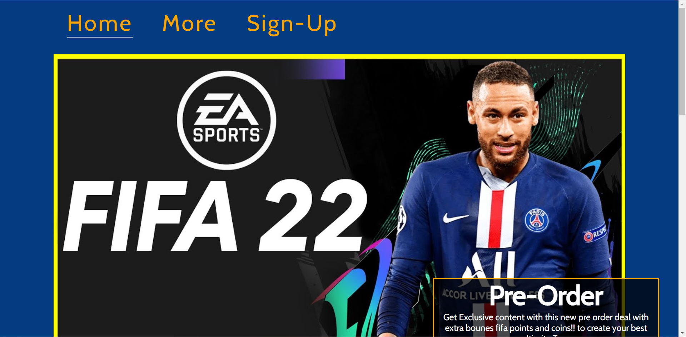
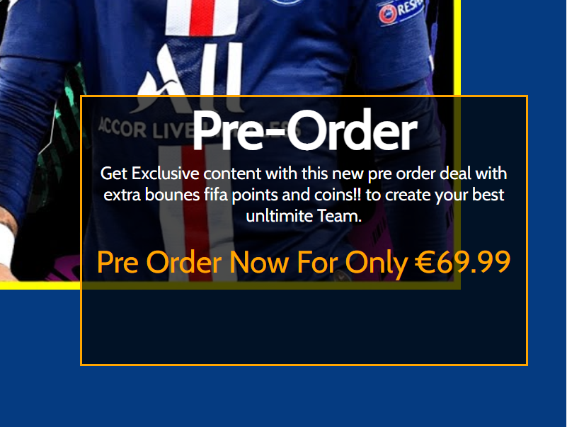
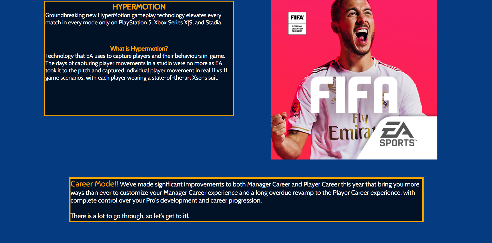

# Fifa 22

The purpose of the Fifa 22 website was to advertise the fifa video game, the advertisment was meant to be for viewers in their teens and under to represent the games age group. 

When a user visit's the home page, they will see a navigation menu, a big fifa 22 picture and a side box with the price for the game on it. It's intended to give the user more knowlege of where they are at. 

## Features 

* Navigation menu
+ My navigation menu has 3 different pages labeled Home, More and Sign-up. I have a underline to mark where on the website the user it at. 
+ My website is linear so that it's very easy to navigate through, the sections are clearly sepearted but not too far from each other, all my content is in a different color from the background so that it stands out. 
+ I have created a color and added a font that makes my content look sporty and that fits in to my product. 

* Header

+ I put multiple images with the header 'Fifa 22' so that the user clearly understands what this webpage is all about.  
 
+ The main header has a box with some Pre Order information, the pre order box tells the user that if you pre order you get exclusive content and then the price below is shown. 

* Home Page Content

+ The home page content talks about what are the new features to the game, this is done in two different boxes. 
+ The content in the home page has a fifa picture with a fifa EA Sports logo. 
+ I have made the content in this type of color scheme to make sure it stands out from the background and that it would look sporty so that it would fit my product. 

* More page
+ 