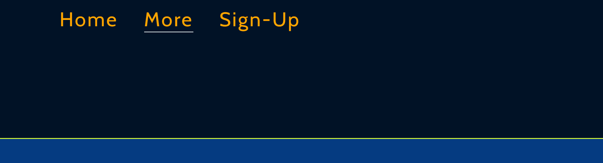
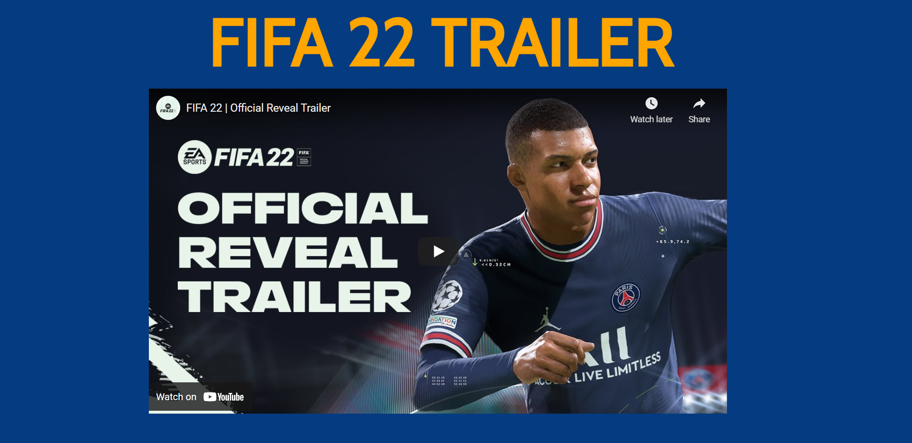
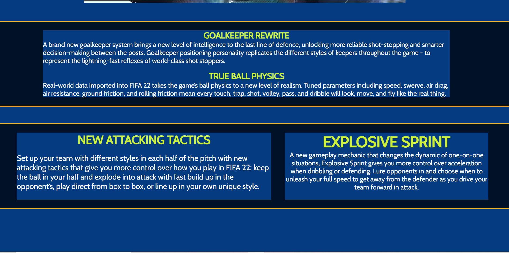
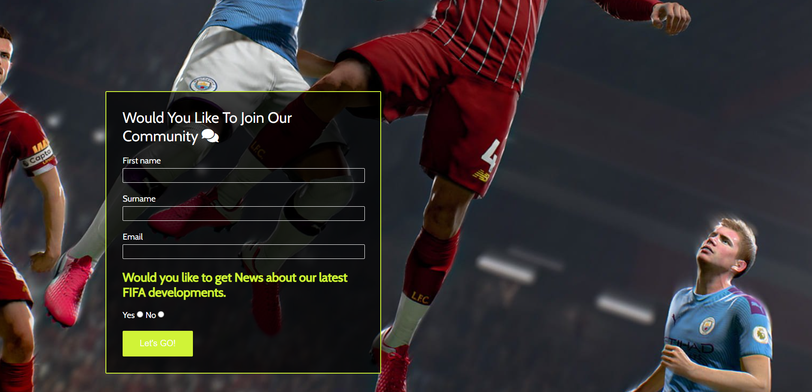
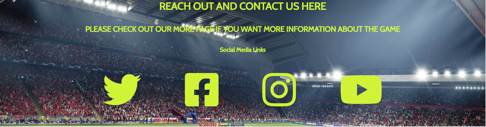
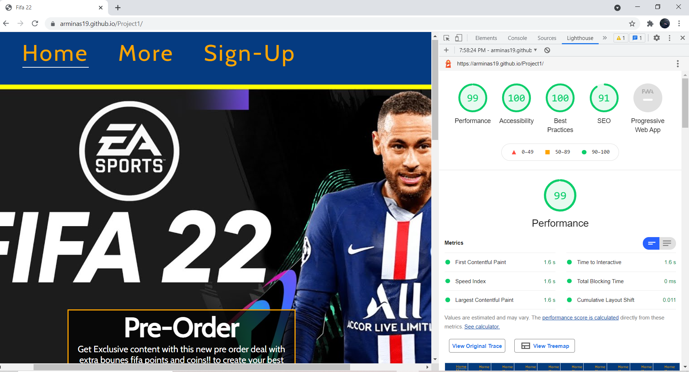

# Fifa 22

The purpose of the Fifa 22 website was to advertise the fifa video game, the advertisment was meant to be for viewers in their teens and under to represent the games age group. 

When a user visit's the home page, they will see a navigation menu, a big fifa 22 picture and a side box with the price for the game on it. It's intended to give the user more knowlege of where they are at. 

## Features 

* Navigation menu
   + My navigation menu has 3 different pages labeled Home, More and Sign-up. I have a underline to mark where on the website the user it at. 
   + My website is linear so that it's very easy to navigate through, the sections are clearly sepearted but not too far from each other, all my content is in a different color from the background so that it stands out. 
   + I have created a color and added a font that makes my content look sporty and that fits in to my product. 

***

* Header

   + I put multiple images with the header 'Fifa 22' so that the user clearly understands what this webpage is all about.  
 
   + The main header has a box with some Pre Order information, the pre order box tells the user that if you pre order you get exclusive content and then the price below is shown. 

***

* Home Page Content

   + The home page content talks about what are the new features to the game, this is done in two different boxes. 
   + The content in the home page has a fifa picture with a fifa EA Sports logo. 
   + I have made the content in this type of color scheme to make sure it stands out from the background and that it would look sporty so that it would fit my product. 

*** 

**More page**
 * header
   + I added some new styling to my naviagtion (in the More page) to add a more cleaner look   

   
 * Fifa 22 trailer
   + I added a video of the offical Fifa 22 trailer to make the website more applealing and interactive to a user. 
   + The video has a title 'Fifa 22 trailer' to let the user know what this video is about.  

   
* More page content 
   + The more page expands content related to the home page. This section focuses on features in the game.
   + I have made the content easy to read by changing the font size and color of my content so that it stands out from the background. 
   + I made the colors a little different than the home page because i wanted to sepearate the two pages apart. 
   
   *** 
* Sign-Up Page
   + The sign up page is intended to be used to join a community of people that talk about fifa and the user also get's an option to get news (updates) about the game. 
   + if a user want's to sign up they need to write their First name, last name and their email (all of this information is required). They also have to check the yes or no option which is also required to sign up.  
   + The sign up form is valuable to the user if they want more information and updates about the game which will not be shown in the website. 
   
   ***
* Footer
   +  I used my footer as a way to create my contact page. Inside my footer their is 4 social media links which the user can click.
   + In big text i have written 'Reach out and contact us here' to let the user know where to go if they want to contact us. 
   + I put a line of text underneate the header of the footer to let the user know where to go if they want to read more information about the games features. 

    
    ## Testing
   + I have tested the sign up form and i have confirmed that the button and link work, you need an email for the email input and all inputs are set to require. 
   + I have confirmed that all the icons and font work. 
   + I have confirmed that all my content is easily readable to the user by showing my website to someone else.
   + I have confirmed that my video is fully controlable and that it fully works like its supposed too.  
   + i have tested my website in different browser's such as: Microsft Edge, Chrome, FireFox
   *** 
   **Bugs** 
* Solved Bugs
   + I had an issue with adding the fifa video to my website, later i found out with some help from code intitute's Tutor assistance that is was my link and i didnt embed it before adding it to my code. 
   + I had an issue with the display:inline; it wouldnt work properly but i figured it out, and margined the home content till it was level. 
   *** 
**Validator Testing**
* HTML
   + No errors or warnings were found for all pages - index More or sign-up.
* CSS 
   + No errors were found but a warning with the contents of 'Imported style sheets are not checked in direct input and file upload modes' which dosnt releat to my css. 
* Accessibility 
   + I have checked lighthouse and confirmed that my website is easily accessible to user.
   
**Unfixed Bugs** 
   + I cant move my iframe video to the left, i tried margin,padding and flaots but the only thing that worked was a one line style but the problem is that i cant use @media on it to set height and width, just couldnt connect my css to this element. 
   + If i had more time i would try and make this website a bit more resposive. 
   ***
   ## Development
* My website was deployed in GitHub pages, theys are the steps i took:
   + In GitHub repository i navigated to settings. 
   + I scrolled down to pages, i clicked on the link. 
   + In the source drop-down menu i selected my  branch as - main, and then i got the link to my website. 
   * Here is the link to my website - https://arminas19.github.io/Project1/ 
 ### Credits 
   **Content** 
   + I took Some of the code from the sign-up form the Love Running Project or 'Challenge'. 
   + I had some inspiration from the links and active class from the Love Running Project, but i didnt copy and paste i just wrote it myself. 

**Media**
   +  I copy and Pasted some text from the offiaclly EA Fifa 22 website - here is their link: https://www.ea.com/en-gb/games/fifa/fifa-22 
   + All my images where taken from this link: https://www.bing.com/images/search?q=fifa+22&form=HDRSC3&first=1&tsc=ImageHoverTitle. 
   + I also used google fonts and icons - link for that: https://fontawesome.com/v5.15/icons/comments?style=solid
